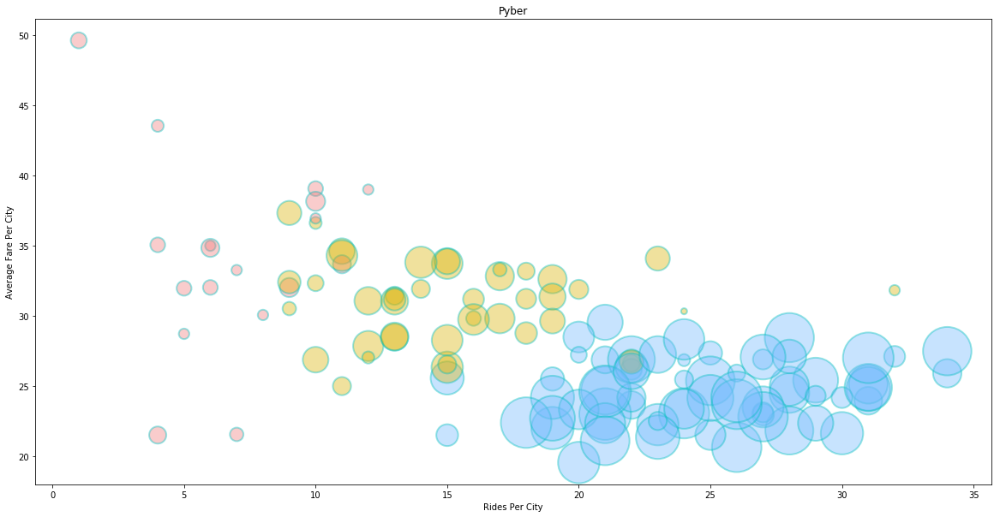
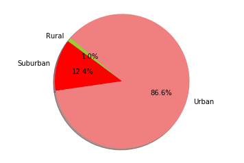
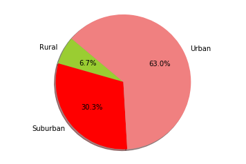
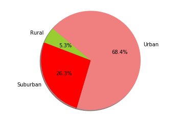

```python
import numpy as np
import pandas as pd
import matplotlib.pyplot as plt
import seaborn as sns
import matplotlib.cm as cm


```


```python
city_data_df = pd.read_csv("city_data.csv")
ride_data_df = pd.read_csv("ride_data.csv")
ride_data_df.head()

```


<div>
<style>
    .dataframe thead tr:only-child th {
        text-align: right;
    }

    .dataframe thead th {
        text-align: left;
    }

    .dataframe tbody tr th {
        vertical-align: top;
    }
</style>
<table border="1" class="dataframe">
  <thead>
    <tr style="text-align: right;">
      <th></th>
      <th>city</th>
      <th>date</th>
      <th>fare</th>
      <th>ride_id</th>
    </tr>
  </thead>
  <tbody>
    <tr>
      <th>0</th>
      <td>Sarabury</td>
      <td>2016-01-16 13:49:27</td>
      <td>38.35</td>
      <td>5403689035038</td>
    </tr>
    <tr>
      <th>1</th>
      <td>South Roy</td>
      <td>2016-01-02 18:42:34</td>
      <td>17.49</td>
      <td>4036272335942</td>
    </tr>
    <tr>
      <th>2</th>
      <td>Wiseborough</td>
      <td>2016-01-21 17:35:29</td>
      <td>44.18</td>
      <td>3645042422587</td>
    </tr>
    <tr>
      <th>3</th>
      <td>Spencertown</td>
      <td>2016-07-31 14:53:22</td>
      <td>6.87</td>
      <td>2242596575892</td>
    </tr>
    <tr>
      <th>4</th>
      <td>Nguyenbury</td>
      <td>2016-07-09 04:42:44</td>
      <td>6.28</td>
      <td>1543057793673</td>
    </tr>
  </tbody>
</table>
</div>


```python
city_data_df.head()

```


<div>
<style>
    .dataframe thead tr:only-child th {
        text-align: right;
    }

    .dataframe thead th {
        text-align: left;
    }

    .dataframe tbody tr th {
        vertical-align: top;
    }
</style>
<table border="1" class="dataframe">
  <thead>
    <tr style="text-align: right;">
      <th></th>
      <th>city</th>
      <th>driver_count</th>
      <th>type</th>
    </tr>
  </thead>
  <tbody>
    <tr>
      <th>0</th>
      <td>Kelseyland</td>
      <td>63</td>
      <td>Urban</td>
    </tr>
    <tr>
      <th>1</th>
      <td>Nguyenbury</td>
      <td>8</td>
      <td>Urban</td>
    </tr>
    <tr>
      <th>2</th>
      <td>East Douglas</td>
      <td>12</td>
      <td>Urban</td>
    </tr>
    <tr>
      <th>3</th>
      <td>West Dawnfurt</td>
      <td>34</td>
      <td>Urban</td>
    </tr>
    <tr>
      <th>4</th>
      <td>Rodriguezburgh</td>
      <td>52</td>
      <td>Urban</td>
    </tr>
  </tbody>
</table>
</div>


```python
# calc data...
#avg fare per city: y-axis
#Total Number of Rides Per City: x-axis
#Total Number of Drivers Per City: circle size
#City Type (Urban, Suburban, Rural): color of bubbles
```


```python
#avg fare per city
new_ride_data = ride_data_df[['city','fare']]
new_ride_group=pd.DataFrame(new_ride_data.groupby(['city']).mean()['fare'])
new_ride_group.head()

```


<div>
<style>
    .dataframe thead tr:only-child th {
        text-align: right;
    }

    .dataframe thead th {
        text-align: left;
    }

    .dataframe tbody tr th {
        vertical-align: top;
    }
</style>
<table border="1" class="dataframe">
  <thead>
    <tr style="text-align: right;">
      <th></th>
      <th>fare</th>
    </tr>
    <tr>
      <th>city</th>
      <th></th>
    </tr>
  </thead>
  <tbody>
    <tr>
      <th>Alvarezhaven</th>
      <td>23.928710</td>
    </tr>
    <tr>
      <th>Alyssaberg</th>
      <td>20.609615</td>
    </tr>
    <tr>
      <th>Anitamouth</th>
      <td>37.315556</td>
    </tr>
    <tr>
      <th>Antoniomouth</th>
      <td>23.625000</td>
    </tr>
    <tr>
      <th>Aprilchester</th>
      <td>21.981579</td>
    </tr>
  </tbody>
</table>
</div>


```python
#rides per city
city_rides = pd.DataFrame(ride_data_df.groupby(['city']).count()[('ride_id')])
city_rides.head(20)
```


<div>
<style>
    .dataframe thead tr:only-child th {
        text-align: right;
    }

    .dataframe thead th {
        text-align: left;
    }

    .dataframe tbody tr th {
        vertical-align: top;
    }
</style>
<table border="1" class="dataframe">
  <thead>
    <tr style="text-align: right;">
      <th></th>
      <th>ride_id</th>
    </tr>
    <tr>
      <th>city</th>
      <th></th>
    </tr>
  </thead>
  <tbody>
    <tr>
      <th>Alvarezhaven</th>
      <td>31</td>
    </tr>
    <tr>
      <th>Alyssaberg</th>
      <td>26</td>
    </tr>
    <tr>
      <th>Anitamouth</th>
      <td>9</td>
    </tr>
    <tr>
      <th>Antoniomouth</th>
      <td>22</td>
    </tr>
    <tr>
      <th>Aprilchester</th>
      <td>19</td>
    </tr>
    <tr>
      <th>Arnoldview</th>
      <td>31</td>
    </tr>
    <tr>
      <th>Campbellport</th>
      <td>15</td>
    </tr>
    <tr>
      <th>Carrollbury</th>
      <td>10</td>
    </tr>
    <tr>
      <th>Carrollfort</th>
      <td>29</td>
    </tr>
    <tr>
      <th>Clarkstad</th>
      <td>12</td>
    </tr>
    <tr>
      <th>Conwaymouth</th>
      <td>11</td>
    </tr>
    <tr>
      <th>Davidtown</th>
      <td>21</td>
    </tr>
    <tr>
      <th>Davistown</th>
      <td>25</td>
    </tr>
    <tr>
      <th>East Cherylfurt</th>
      <td>13</td>
    </tr>
    <tr>
      <th>East Douglas</th>
      <td>22</td>
    </tr>
    <tr>
      <th>East Erin</th>
      <td>28</td>
    </tr>
    <tr>
      <th>East Jenniferchester</th>
      <td>19</td>
    </tr>
    <tr>
      <th>East Leslie</th>
      <td>11</td>
    </tr>
    <tr>
      <th>East Stephen</th>
      <td>10</td>
    </tr>
    <tr>
      <th>East Troybury</th>
      <td>7</td>
    </tr>
  </tbody>
</table>
</div>


```python
#driver count
driver_count = city_data_df.groupby(['city']).sum()[('driver_count')]
driver_count.head()
```


    city
    Alvarezhaven    21
    Alyssaberg      67
    Anitamouth      16
    Antoniomouth    21
    Aprilchester    49
    Name: driver_count, dtype: int64


```python
#city type
city_data_df=city_data_df.sort_values(by=['city'], ascending=True)
city_type_df = city_data_df[['city', 'type']].set_index('city')
#assign colors to ciy-types
city_type_df=city_type_df[['type']].replace({'Urban': '#75bbfd', 'Suburban': '#dbb40c', 'Rural': '#f08080' })
city_type_df.groupby('city')
city_type_df.head()

```


<div>
<style>
    .dataframe thead tr:only-child th {
        text-align: right;
    }

    .dataframe thead th {
        text-align: left;
    }

    .dataframe tbody tr th {
        vertical-align: top;
    }
</style>
<table border="1" class="dataframe">
  <thead>
    <tr style="text-align: right;">
      <th></th>
      <th>type</th>
    </tr>
    <tr>
      <th>city</th>
      <th></th>
    </tr>
  </thead>
  <tbody>
    <tr>
      <th>Alvarezhaven</th>
      <td>#75bbfd</td>
    </tr>
    <tr>
      <th>Alyssaberg</th>
      <td>#75bbfd</td>
    </tr>
    <tr>
      <th>Anitamouth</th>
      <td>#dbb40c</td>
    </tr>
    <tr>
      <th>Antoniomouth</th>
      <td>#75bbfd</td>
    </tr>
    <tr>
      <th>Aprilchester</th>
      <td>#75bbfd</td>
    </tr>
  </tbody>
</table>
</div>


```python
# making the scatter plot

plt.figure(figsize=(20,10))
plt.scatter(city_rides['ride_id'], new_ride_group['fare'], s=driver_count*50, c=city_type_df['type'], linewidths=2, edgecolor='c', alpha=0.4)
plt.title("Pyber")
plt.xlabel("Rides Per City")
plt.ylabel("Average Fare Per City")
#legend

plt.show()
```


    <matplotlib.figure.Figure at 0x10df36cc0>





```python
#calc data for pie charts
```


```python
merged_table = pd.merge(ride_data_df, city_data_df, on="city", how="left")
merged_table

```


<div>
<style>
    .dataframe thead tr:only-child th {
        text-align: right;
    }

    .dataframe thead th {
        text-align: left;
    }

    .dataframe tbody tr th {
        vertical-align: top;
    }
</style>
<table border="1" class="dataframe">
  <thead>
    <tr style="text-align: right;">
      <th></th>
      <th>city</th>
      <th>date</th>
      <th>fare</th>
      <th>ride_id</th>
      <th>driver_count</th>
      <th>type</th>
    </tr>
  </thead>
  <tbody>
    <tr>
      <th>0</th>
      <td>Sarabury</td>
      <td>2016-01-16 13:49:27</td>
      <td>38.35</td>
      <td>5403689035038</td>
      <td>46</td>
      <td>Urban</td>
    </tr>
    <tr>
      <th>1</th>
      <td>South Roy</td>
      <td>2016-01-02 18:42:34</td>
      <td>17.49</td>
      <td>4036272335942</td>
      <td>35</td>
      <td>Urban</td>
    </tr>
    <tr>
      <th>2</th>
      <td>Wiseborough</td>
      <td>2016-01-21 17:35:29</td>
      <td>44.18</td>
      <td>3645042422587</td>
      <td>55</td>
      <td>Urban</td>
    </tr>
    <tr>
      <th>3</th>
      <td>Spencertown</td>
      <td>2016-07-31 14:53:22</td>
      <td>6.87</td>
      <td>2242596575892</td>
      <td>68</td>
      <td>Urban</td>
    </tr>
    <tr>
      <th>4</th>
      <td>Nguyenbury</td>
      <td>2016-07-09 04:42:44</td>
      <td>6.28</td>
      <td>1543057793673</td>
      <td>8</td>
      <td>Urban</td>
    </tr>
    <tr>
      <th>5</th>
      <td>New Jeffrey</td>
      <td>2016-02-22 18:36:25</td>
      <td>36.01</td>
      <td>9757888452346</td>
      <td>58</td>
      <td>Urban</td>
    </tr>
    <tr>
      <th>6</th>
      <td>Port Johnstad</td>
      <td>2016-06-07 02:39:58</td>
      <td>17.15</td>
      <td>4352278259335</td>
      <td>22</td>
      <td>Urban</td>
    </tr>
    <tr>
      <th>7</th>
      <td>Jacobfort</td>
      <td>2016-09-20 20:58:37</td>
      <td>22.98</td>
      <td>1500221409082</td>
      <td>52</td>
      <td>Urban</td>
    </tr>
    <tr>
      <th>8</th>
      <td>Travisville</td>
      <td>2016-01-15 17:32:02</td>
      <td>27.39</td>
      <td>850152768361</td>
      <td>37</td>
      <td>Urban</td>
    </tr>
    <tr>
      <th>9</th>
      <td>Sandymouth</td>
      <td>2016-11-16 07:27:00</td>
      <td>21.61</td>
      <td>2389035050524</td>
      <td>11</td>
      <td>Urban</td>
    </tr>
    <tr>
      <th>10</th>
      <td>New Andreamouth</td>
      <td>2016-04-11 07:20:48</td>
      <td>7.72</td>
      <td>9992929847990</td>
      <td>42</td>
      <td>Urban</td>
    </tr>
    <tr>
      <th>11</th>
      <td>New Christine</td>
      <td>2016-09-13 15:06:42</td>
      <td>24.89</td>
      <td>7918411468537</td>
      <td>22</td>
      <td>Urban</td>
    </tr>
    <tr>
      <th>12</th>
      <td>Stewartview</td>
      <td>2016-03-29 05:15:56</td>
      <td>23.88</td>
      <td>6778235889588</td>
      <td>49</td>
      <td>Urban</td>
    </tr>
    <tr>
      <th>13</th>
      <td>Rodriguezburgh</td>
      <td>2016-09-05 05:20:39</td>
      <td>4.54</td>
      <td>9650770953139</td>
      <td>52</td>
      <td>Urban</td>
    </tr>
    <tr>
      <th>14</th>
      <td>West Sydneyhaven</td>
      <td>2016-08-02 21:18:44</td>
      <td>12.87</td>
      <td>7994760397230</td>
      <td>70</td>
      <td>Urban</td>
    </tr>
    <tr>
      <th>15</th>
      <td>Swansonbury</td>
      <td>2016-07-11 18:42:11</td>
      <td>39.30</td>
      <td>744481862626</td>
      <td>64</td>
      <td>Urban</td>
    </tr>
    <tr>
      <th>16</th>
      <td>Lisatown</td>
      <td>2016-07-05 18:09:14</td>
      <td>5.82</td>
      <td>6370359473201</td>
      <td>47</td>
      <td>Urban</td>
    </tr>
    <tr>
      <th>17</th>
      <td>East Erin</td>
      <td>2016-11-03 01:03:05</td>
      <td>7.51</td>
      <td>4744239092530</td>
      <td>43</td>
      <td>Urban</td>
    </tr>
    <tr>
      <th>18</th>
      <td>Port Martinberg</td>
      <td>2016-01-06 17:11:30</td>
      <td>8.66</td>
      <td>7298562820881</td>
      <td>44</td>
      <td>Urban</td>
    </tr>
    <tr>
      <th>19</th>
      <td>Wiseborough</td>
      <td>2016-09-12 18:43:41</td>
      <td>26.83</td>
      <td>9304728540000</td>
      <td>55</td>
      <td>Urban</td>
    </tr>
    <tr>
      <th>20</th>
      <td>Edwardsbury</td>
      <td>2016-02-27 03:55:54</td>
      <td>20.17</td>
      <td>8514523868075</td>
      <td>11</td>
      <td>Urban</td>
    </tr>
    <tr>
      <th>21</th>
      <td>Jacobfort</td>
      <td>2016-06-12 17:01:29</td>
      <td>34.47</td>
      <td>4135673527977</td>
      <td>52</td>
      <td>Urban</td>
    </tr>
    <tr>
      <th>22</th>
      <td>Pamelahaven</td>
      <td>2016-03-26 12:56:57</td>
      <td>36.43</td>
      <td>3015329826849</td>
      <td>30</td>
      <td>Urban</td>
    </tr>
    <tr>
      <th>23</th>
      <td>Fosterside</td>
      <td>2016-08-12 11:52:41</td>
      <td>28.08</td>
      <td>133077693483</td>
      <td>69</td>
      <td>Urban</td>
    </tr>
    <tr>
      <th>24</th>
      <td>Jacobfort</td>
      <td>2016-09-17 12:38:58</td>
      <td>38.25</td>
      <td>2182376146051</td>
      <td>52</td>
      <td>Urban</td>
    </tr>
    <tr>
      <th>25</th>
      <td>West Sydneyhaven</td>
      <td>2016-08-23 14:49:59</td>
      <td>36.12</td>
      <td>5885997568611</td>
      <td>70</td>
      <td>Urban</td>
    </tr>
    <tr>
      <th>26</th>
      <td>West Alexis</td>
      <td>2016-01-16 00:33:02</td>
      <td>26.62</td>
      <td>1574788996743</td>
      <td>47</td>
      <td>Urban</td>
    </tr>
    <tr>
      <th>27</th>
      <td>Carrollfort</td>
      <td>2016-06-24 20:11:11</td>
      <td>6.45</td>
      <td>1092683495142</td>
      <td>55</td>
      <td>Urban</td>
    </tr>
    <tr>
      <th>28</th>
      <td>New David</td>
      <td>2016-01-12 20:48:43</td>
      <td>38.68</td>
      <td>5229089333754</td>
      <td>31</td>
      <td>Urban</td>
    </tr>
    <tr>
      <th>29</th>
      <td>Stewartview</td>
      <td>2016-10-15 05:26:40</td>
      <td>11.74</td>
      <td>8402784599831</td>
      <td>49</td>
      <td>Urban</td>
    </tr>
    <tr>
      <th>...</th>
      <td>...</td>
      <td>...</td>
      <td>...</td>
      <td>...</td>
      <td>...</td>
      <td>...</td>
    </tr>
    <tr>
      <th>2345</th>
      <td>West Kevintown</td>
      <td>2016-06-15 19:53:16</td>
      <td>13.50</td>
      <td>9577921579881</td>
      <td>5</td>
      <td>Rural</td>
    </tr>
    <tr>
      <th>2346</th>
      <td>Matthewside</td>
      <td>2016-02-23 00:43:51</td>
      <td>40.84</td>
      <td>8665248512368</td>
      <td>4</td>
      <td>Rural</td>
    </tr>
    <tr>
      <th>2347</th>
      <td>Erikport</td>
      <td>2016-11-26 04:39:52</td>
      <td>44.21</td>
      <td>9598643212986</td>
      <td>3</td>
      <td>Rural</td>
    </tr>
    <tr>
      <th>2348</th>
      <td>Kinghaven</td>
      <td>2016-07-23 08:23:50</td>
      <td>46.08</td>
      <td>8440329717166</td>
      <td>3</td>
      <td>Rural</td>
    </tr>
    <tr>
      <th>2349</th>
      <td>Hernandezshire</td>
      <td>2016-02-24 17:30:44</td>
      <td>44.68</td>
      <td>6389115653382</td>
      <td>10</td>
      <td>Rural</td>
    </tr>
    <tr>
      <th>2350</th>
      <td>Kennethburgh</td>
      <td>2016-01-01 04:31:43</td>
      <td>33.53</td>
      <td>5149088250183</td>
      <td>3</td>
      <td>Rural</td>
    </tr>
    <tr>
      <th>2351</th>
      <td>Stevensport</td>
      <td>2016-02-22 02:45:07</td>
      <td>19.91</td>
      <td>808097865942</td>
      <td>6</td>
      <td>Rural</td>
    </tr>
    <tr>
      <th>2352</th>
      <td>South Elizabethmouth</td>
      <td>2016-11-23 07:47:18</td>
      <td>46.39</td>
      <td>1939838068038</td>
      <td>3</td>
      <td>Rural</td>
    </tr>
    <tr>
      <th>2353</th>
      <td>East Stephen</td>
      <td>2016-07-30 21:25:01</td>
      <td>35.39</td>
      <td>1107870956099</td>
      <td>6</td>
      <td>Rural</td>
    </tr>
    <tr>
      <th>2354</th>
      <td>Jacksonfort</td>
      <td>2016-10-01 13:41:00</td>
      <td>34.17</td>
      <td>7750597960630</td>
      <td>6</td>
      <td>Rural</td>
    </tr>
    <tr>
      <th>2355</th>
      <td>Kennethburgh</td>
      <td>2016-04-30 20:44:27</td>
      <td>23.58</td>
      <td>4524301143267</td>
      <td>3</td>
      <td>Rural</td>
    </tr>
    <tr>
      <th>2356</th>
      <td>Horneland</td>
      <td>2016-03-25 02:05:42</td>
      <td>20.04</td>
      <td>5729327140644</td>
      <td>8</td>
      <td>Rural</td>
    </tr>
    <tr>
      <th>2357</th>
      <td>Shelbyhaven</td>
      <td>2016-01-25 01:39:16</td>
      <td>59.43</td>
      <td>8088329954312</td>
      <td>9</td>
      <td>Rural</td>
    </tr>
    <tr>
      <th>2358</th>
      <td>Erikport</td>
      <td>2016-08-03 21:19:11</td>
      <td>47.67</td>
      <td>9201708664049</td>
      <td>3</td>
      <td>Rural</td>
    </tr>
    <tr>
      <th>2359</th>
      <td>Kennethburgh</td>
      <td>2016-11-19 06:59:31</td>
      <td>18.37</td>
      <td>5897895798960</td>
      <td>3</td>
      <td>Rural</td>
    </tr>
    <tr>
      <th>2360</th>
      <td>Jacksonfort</td>
      <td>2016-10-20 16:42:54</td>
      <td>37.75</td>
      <td>4356781814784</td>
      <td>6</td>
      <td>Rural</td>
    </tr>
    <tr>
      <th>2361</th>
      <td>South Joseph</td>
      <td>2016-10-15 03:53:06</td>
      <td>32.50</td>
      <td>2758038144583</td>
      <td>3</td>
      <td>Rural</td>
    </tr>
    <tr>
      <th>2362</th>
      <td>Matthewside</td>
      <td>2016-05-18 02:00:30</td>
      <td>48.67</td>
      <td>2049161404256</td>
      <td>4</td>
      <td>Rural</td>
    </tr>
    <tr>
      <th>2363</th>
      <td>Matthewside</td>
      <td>2016-08-08 14:02:35</td>
      <td>24.97</td>
      <td>2872494724827</td>
      <td>4</td>
      <td>Rural</td>
    </tr>
    <tr>
      <th>2364</th>
      <td>South Joseph</td>
      <td>2016-10-28 09:52:15</td>
      <td>25.34</td>
      <td>6706101910500</td>
      <td>3</td>
      <td>Rural</td>
    </tr>
    <tr>
      <th>2365</th>
      <td>South Elizabethmouth</td>
      <td>2016-07-19 09:35:59</td>
      <td>31.09</td>
      <td>2959749591417</td>
      <td>3</td>
      <td>Rural</td>
    </tr>
    <tr>
      <th>2366</th>
      <td>North Whitney</td>
      <td>2016-11-11 16:24:16</td>
      <td>22.99</td>
      <td>3454326063039</td>
      <td>10</td>
      <td>Rural</td>
    </tr>
    <tr>
      <th>2367</th>
      <td>New Johnbury</td>
      <td>2016-08-29 02:36:06</td>
      <td>18.83</td>
      <td>7368222134792</td>
      <td>6</td>
      <td>Rural</td>
    </tr>
    <tr>
      <th>2368</th>
      <td>East Leslie</td>
      <td>2016-06-22 07:45:30</td>
      <td>34.54</td>
      <td>684950063164</td>
      <td>9</td>
      <td>Rural</td>
    </tr>
    <tr>
      <th>2369</th>
      <td>Kennethburgh</td>
      <td>2016-06-07 11:43:43</td>
      <td>56.02</td>
      <td>311733202150</td>
      <td>3</td>
      <td>Rural</td>
    </tr>
    <tr>
      <th>2370</th>
      <td>West Kevintown</td>
      <td>2016-02-10 00:50:04</td>
      <td>34.69</td>
      <td>9595491362610</td>
      <td>5</td>
      <td>Rural</td>
    </tr>
    <tr>
      <th>2371</th>
      <td>East Troybury</td>
      <td>2016-03-14 01:55:32</td>
      <td>38.80</td>
      <td>9205811495606</td>
      <td>3</td>
      <td>Rural</td>
    </tr>
    <tr>
      <th>2372</th>
      <td>North Whitney</td>
      <td>2016-01-26 01:06:41</td>
      <td>34.92</td>
      <td>4165974278063</td>
      <td>10</td>
      <td>Rural</td>
    </tr>
    <tr>
      <th>2373</th>
      <td>South Joseph</td>
      <td>2016-09-28 07:30:55</td>
      <td>12.55</td>
      <td>4336212615821</td>
      <td>3</td>
      <td>Rural</td>
    </tr>
    <tr>
      <th>2374</th>
      <td>South Elizabethmouth</td>
      <td>2016-04-21 10:20:09</td>
      <td>16.50</td>
      <td>5702608059064</td>
      <td>3</td>
      <td>Rural</td>
    </tr>
  </tbody>
</table>
<p>2375 rows × 6 columns</p>
</div>


```python
total_fares = merged_table['fare'].sum()
merged_table_fares_df = merged_table.groupby(['type']).sum()['fare']/total_fares*100
merged_table_fares_df.head()

```


    type
    Rural        6.68500
    Suburban    30.34954
    Urban       62.96546
    Name: fare, dtype: float64


```python
total_rides = merged_table['ride_id'].count()
merged_table_rides_df = merged_table.groupby(['type']).count()['ride_id']/total_rides*100
merged_table_rides_df.head()
```


    type
    Rural        5.263158
    Suburban    26.315789
    Urban       68.421053
    Name: ride_id, dtype: float64


```python
total_drivers= merged_table['driver_count'].sum()
merged_table_drivers_df = merged_table.groupby(['type']).sum()['driver_count']/total_drivers*100
merged_table_drivers_df.head()
```


    type
    Rural        0.976127
    Suburban    12.419775
    Urban       86.604098
    Name: driver_count, dtype: float64


merged_table = merged_table.groupby(['type']).sum()[('fare')])


```python
#Pie charts
#% of Total Fares by City Type
#% of Total Rides by City Type
#% of Total Drivers by City Type


# Labels for the sections of our pie chart
labels = ["Rural", "Suburban", "Urban"]


# The colors of each section of the pie chart
colors = ["yellowgreen", "red", "lightcoral", "lightskyblue"]

plt.title=('% of Total Drivers by City Type')
# Creates the pie chart based upon the values above
# Automatically finds the percentages of each part of the pie chart
plt.pie(merged_table_drivers_df, labels=labels, colors=colors, autopct='%1.1f%%',
       shadow=True, startangle=140)

# Tells matplotlib that we want a pie chart with equal axes
plt.axis("equal")
plt.show()
```





```python
# Labels for the sections of our pie chart
labels = ["Rural", "Suburban", "Urban"]


# The colors of each section of the pie chart
colors = ["yellowgreen", "red", "lightcoral", "lightskyblue"]

plt.title=('% of Total Fares by City Type')
# Creates the pie chart based upon the values above
# Automatically finds the percentages of each part of the pie chart
plt.pie(merged_table_fares_df, labels=labels, colors=colors, autopct='%1.1f%%',
       shadow=True, startangle=140)

# Tells matplotlib that we want a pie chart with equal axes
plt.axis("equal")
plt.show()
```





```python
# Labels for the sections of our pie chart
labels = ["Rural", "Suburban", "Urban"]


# The colors of each section of the pie chart
colors = ["yellowgreen", "red", "lightcoral", "lightskyblue"]

plt.title=('% of Total Rides by City Type')
# Creates the pie chart based upon the values above
# Automatically finds the percentages of each part of the pie chart
plt.pie(merged_table_rides_df, labels=labels, colors=colors, autopct='%1.1f%%',
       shadow=True, startangle=140)

# Tells matplotlib that we want a pie chart with equal axes
plt.axis("equal")
plt.show()
```





```python
#observations: seems like the suburbs are a good place to be, with fewer drivers, but garnering 
#a good % of the total fares and rides; you can see from the bubble chart too, that there are
#alot of rides given in the Urban cities, with alot of drivers, but the average fares are low;
#rural cities have some of the highest average fares, but not alot of rides overall; suburbs are
# in a good middle ground, with higher average fares, and a decent amount of rides. 
```
